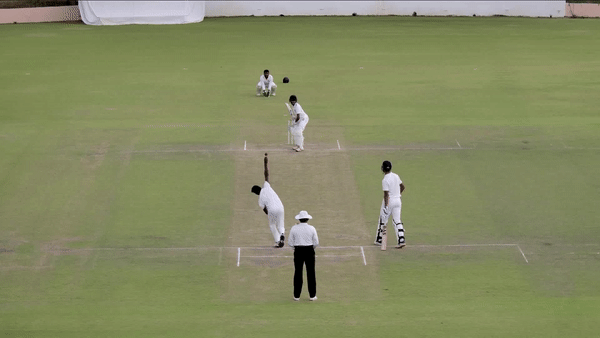

# <div align="center">Cricket-ball-tracking</div>
Project is about to track the ball in a video clip of cricket match. This project is build upon YOLO3 architecture. YOLO is fine tuned on real time cricket scene images. fine tuned utilizes to track the ball path in real time videos.

## <div align="center">Documentation</div>

See the [YOLOv3 Docs](https://docs.ultralytics.com) for full documentation on training, testing and deployment.

## <div align="center">Quick Start Examples</div>

## Install

[**Python>=3.6.0**](https://www.python.org/) is required with all
[requirements.txt](https://github.com/ultralytics/yolov3/blob/master/requirements.txt) installed including
[**PyTorch>=1.7**](https://pytorch.org/get-started/locally/):
<!-- $ sudo apt update && apt install -y libgl1-mesa-glx libsm6 libxext6 libxrender-dev -->

```bash
$ pip install -r requirements.txt
```

## Inference with detect.py
`detect.py` runs inference on a videos. latest weights need to selected at inference time. 

```bash
$ python detect.py --weights runs/train/exp7/weights/best.pt --source /path/to/video.mp4
                            
```

<p float="left">
  
   
</p>

<div align="left"></div>


<details open>
<summary>Training process</summary>

* [Train Custom Data](https://github.com/ultralytics/yolov3/wiki/Train-Custom-Data)&nbsp;
</details>

<details>
<summary>Tutorials</summary>

* [Train Custom Data](https://github.com/ultralytics/yolov3/wiki/Train-Custom-Data)&nbsp; 🚀 RECOMMENDED
* [Tips for Best Training Results](https://github.com/ultralytics/yolov3/wiki/Tips-for-Best-Training-Results)&nbsp; ☘️
  RECOMMENDED
* [Weights & Biases Logging](https://github.com/ultralytics/yolov5/issues/1289)&nbsp; 🌟 NEW
* [Roboflow for Datasets, Labeling, and Active Learning](https://github.com/ultralytics/yolov5/issues/4975)&nbsp; 🌟 NEW
* [Multi-GPU Training](https://github.com/ultralytics/yolov5/issues/475)
* [PyTorch Hub](https://github.com/ultralytics/yolov5/issues/36)&nbsp; ⭐ NEW
* [TorchScript, ONNX, CoreML Export](https://github.com/ultralytics/yolov5/issues/251) 🚀
* [Test-Time Augmentation (TTA)](https://github.com/ultralytics/yolov5/issues/303)
* [Model Ensembling](https://github.com/ultralytics/yolov5/issues/318)
* [Model Pruning/Sparsity](https://github.com/ultralytics/yolov5/issues/304)
* [Hyperparameter Evolution](https://github.com/ultralytics/yolov5/issues/607)
* [Transfer Learning with Frozen Layers](https://github.com/ultralytics/yolov5/issues/1314)&nbsp; 

</details>


 


